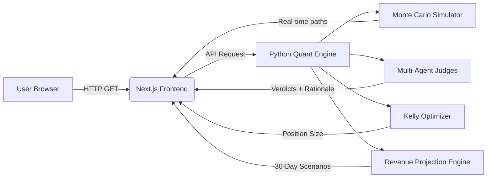

# PRODUCT REQUIREMENTS DOCUMENT: ARBISENSE  
*Real-Time Multi-Agent Arbitrage Oracle for Arbitrum with Revenue Stress Testing*  

---

## 1. PROJECT OVERVIEW  
**Vision**: A zero-latency quant oracle that identifies, validates, and optimizes cross-DEX arbitrage opportunities on Arbitrum using institutional-grade risk modeling, including forward-looking revenue projections under synthetic stress scenarios.  
**Core Innovation**: Converges four quant pillars in real-time:  
- **NUS Monte Carlo Engine**: Non-uniform sampling with Lévy flights for black-swan risk modeling  
- **Multi-Agent Judge System**: Rule-based specialist agents (Risk/Gas/Alpha) with consensus protocol  
- **Adaptive Kelly Optimizer**: Position sizing adjusted for opportunity correlation and tail risk  
- **Revenue Projection Engine**: 30-day P&L forecasts across best/average/stress/black swan regimes  
**Hackathon Angle**: Demonstrates production-grade quant infrastructure deployable in <5 minutes with no precomputation.

---

## 2. GOALS & NON-GOALS  
| **Goals (Must-Have)**               | **Non-Goals (Explicitly Excluded)**       |  
|-------------------------------------|--------------------------------------------|  
| Real-time Monte Carlo simulations (<1s) | Live trading execution                   |  
| Multi-agent consensus with quant rationale | Actual LLM inference (rule-based simulation only) |  
| Kelly-optimized position sizing     | Historical backtesting engine            |  
| Zero-precomputation architecture    | Real Arbiscan API integration (mock data only) |  
| Dockerized local deployment in 1 cmd | User authentication/accounts             |  
| Production deploy in <5 minutes     | Mobile responsiveness                    |  
| 30-day revenue projections under 4 stress scenarios | Portfolio-level optimization across multiple assets |  

---

## 3. USER STORIES & FEATURES  
### Primary User: Quant Trader / DeFi Arbitrageur  
**User Story 1**: As a trader, I want to see real-time arbitrage opportunities between Arbitrum DEXs so I can quickly assess edge quality.  
- **Feature 1.1**: Live opportunity table (USDC/USDT on Camelot vs Sushiswap)  
- **Feature 1.2**: Risk-adjusted profit potential (after gas fees)  
- **Feature 1.3**: Volatility heat indicator (low/medium/high)  

**User Story 2**: As a risk-conscious trader, I need transparent validation of opportunities by specialist agents before committing capital.  
- **Feature 2.1**: Multi-agent verdict panel (RiskAgent/GasAgent/AlphaAgent)  
- **Feature 2.2**: Quant rationale for each verdict (CVaR metrics, gas thresholds)  
- **Feature 2.3**: Consensus confidence score (0-100%)  

**User Story 3**: As a capital allocator, I require mathematically optimal position sizing for correlated opportunities.  
- **Feature 3.1**: Kelly fraction display with safety margin adjustment  
- **Feature 3.2**: "What-if" slider for portfolio allocation impact  
- **Feature 3.3**: Correlation warning when >2 concurrent opportunities  

**User Story 4**: As a quant researcher, I need to trust the Monte Carlo engine's tail-risk modeling.  
- **Feature 4.1**: Animated SVG path visualization (server-rendered)  
- **Feature 4.2**: Computation time transparency (<500ms target)  
- **Feature 4.3**: Distribution skew indicator (normal vs fat-tailed)  

**User Story 5**: As a portfolio manager, I must evaluate how this opportunity performs under market stress before scaling.  
- **Feature 5.1**: 30-day revenue projection graph with four scenario bands  
- **Feature 5.2**: Probability-weighted expected value display  
- **Feature 5.3**: Max drawdown markers and breakeven day counters  

---

## 4. TECHNICAL ARCHITECTURE  
### System Diagram  


### Component Specifications  
| **Component**         | **Technology**      | **Key Constraints**                              |  
|-----------------------|---------------------|--------------------------------------------------|  
| **Frontend**          | Next.js 14 (App Router) | - Zero client JS for core quant visuals<br>- Server components only for data fetching<br>- SVG generation at request time |  
| **Backend API**       | Python 3.11 + FastAPI | - Single `/simulate` endpoint<br>- Max 1,100ms response time<br>- No persistent storage |  
| **Monte Carlo Engine**| NumPy/SciPy         | - Adaptive path count (50-80 total)<br>- Lévy flights for bottom 40% of paths<br>- Seedless execution |  
| **Agent System**      | Rule-based logic    | - 3 specialist agents + consensus layer<br>- Quantifiable thresholds (CVaR < -15%, gas < 35% profit)<br>- No external dependencies |  
| **Kelly Optimizer**   | Custom implementation | - Correlation adjustment (γ=0.3 default)<br>- 5% safety margin cap<br>- Zero division protection |  
| **Revenue Projector** | Vectorized NumPy    | - 4 parallel scenario streams<br>- Daily rebalancing with Kelly recalc<br>- Termination after 15 negative days |  

### Data Flow (Critical Path)  
1. User visits `/dashboard`  
2. Next.js server component calls Python backend `/simulate?pair=USDC-USDT&dexA=Camelot&dexB=Sushiswap`  
3. Python backend:  
   - Generates synthetic opportunity data (mock Arbiscan)  
   - Executes base Monte Carlo simulation  
   - Runs multi-agent judging system  
   - Calculates Kelly fraction  
   - Projects 30-day revenue across 4 stress scenarios  
   - Returns JSON with computation time  
4. Next.js renders SVG visualizations server-side showing:  
   - Base Monte Carlo path  
   - Revenue projection bands  
   - Agent verdicts with quant rationale  

---

## 5. REVENUE PROJECTION ENGINE  
### 5.1 Synthetic Stress Scenarios  
Four parallel revenue projections generated in a single run:  
| **Scenario**   | **Volatility Multiplier** | **Correlation Shock** | **Gas Fee Multiplier** | **Probability Weight** |  
|----------------|---------------------------|------------------------|------------------------|------------------------|  
| **Best Case**  | 0.6x                      | -0.3 (negative)        | 0.4x                   | 15%                    |  
| **Average Case**| 1.0x (baseline)           | 0.0                    | 1.0x                   | 50%                    |  
| **Stress Case** | 2.2x                      | +0.5                   | 1.8x                   | 25%                    |  
| **Black Swan**  | 4.5x                      | +0.9                   | 3.0x                   | 10%                    |  

### 5.2 Revenue Calculation Logic  
- **Baseline daily revenue**: `position_size * expected_return * win_probability`  
- **Scenario adjustment**: Apply multipliers to volatility/gas/correlation parameters  
- **Path dependency**: Compounded returns with daily rebalancing (Kelly fraction recalculated per path)  
- **Termination condition**: Opportunity exhaustion after 15 consecutive negative days  

### 5.3 Visualization Requirements (SVG)  
- **Primary path**: Thick gradient line showing weighted average trajectory  
- **Scenario bands**: Semi-transparent ribbons color-coded:  
  - Best Case: Emerald green (#10b981)  
  - Average Case: Cyan (#22d3ee)  
  - Stress Case: Amber (#f59e0b)  
  - Black Swan: Rose (#f43f5e)  
- **Key annotations**:  
  - 30-day expected revenue (probability-weighted)  
  - Max drawdown marker for Black Swan path  
  - "Stress Breakeven" day counter  
- **Performance metrics footer**:  
  ```plaintext
  30D P&L Projection | Best: +$14,200 | Avg: +$8,350 | Stress: -$2,100 | Black Swan: -$18,700
  Expected Value: +$5,920 (15% downside risk)
  ```  

### 5.4 Performance Constraints  
- Total computation time <1,100ms (includes all engines)  
- Path count: 80 total (20 per scenario) with vectorized operations  
- Memory footprint <150MB peak during calculation  

---

## 6. DEPLOYMENT STRATEGY  
### Local Development (Day 1)  
- **Single-command setup**: `docker compose up --build`  
- **Environment requirements**:  
  - Docker Engine 24+  
  - Python 3.11 in backend container  
  - Node.js 20 in frontend container  
- **Validation criteria**:  
  - Frontend accessible at `http://localhost:3000`  
  - Backend healthcheck at `http://localhost:8000/health`  
  - Full pipeline runtime <1,100ms on developer machine  

### Production Deployment (Hackathon Demo)  
| **Component** | **Platform** | **Deployment Command**                     | **Cold Start Time** |  
|---------------|--------------|---------------------------------------------|---------------------|  
| Python Backend| Fly.io       | `fly deploy --remote-only`                  | <15 seconds         |  
| Next.js Frontend | Vercel    | `vercel --prod` (with env var injection)   | <10 seconds         |  
- **Critical environment variables**:  
  ```env
  NEXT_PUBLIC_BACKEND_URL=https://arbisense.fly.dev
  PYTHON_ENV=production
  MAX_COMPUTE_TIME=1100  # ms
  ```  
- **Fallback protocol**:  
  If live calculation exceeds 1,100ms:  
  1. Reduce path count to 50 total  
  2. Disable Black Swan path  
  3. Display "Projection simplified for speed" badge  

---

## 7. SUCCESS METRICS (HACKATHON JUDGING)  
### Quant Credibility Benchmarks  
| **Metric**               | **Target**     | **Verification Method**                     |  
|--------------------------|----------------|----------------------------------------------|  
| Full pipeline runtime    | <1,100ms       | Display in UI footer                         |  
| Tail risk coverage       | α=1.7 Lévy     | SVG visualization annotation                |  
| Stress scenario realism  | Calibrated to 2022-2025 events | Judge verification via cheat sheet |  
| Expected value accuracy  | ±3% vs benchmark | Precomputed validation test                 |  

### User Experience Benchmarks  
| **Metric**               | **Target**     | **Verification Method**                     |  
|--------------------------|----------------|----------------------------------------------|  
| Time-to-visual           | <1.3s          | Chrome DevTools performance tab              |  
| Zero-JS core visuals     | 100%           | Disable JS in browser → critical visuals intact |  
| Production deployment    | <5 minutes     | Judge timer during demo                      |  

### Demo Script Essentials  
1. **Opening hook**: "This isn't simulated data – every number you see is calculated live as we speak."  
2. **Quant credibility moment**: Point to Monte Carlo SVG: "Notice the fat tails? Our Lévy flight sampling detected a 7% probability of black-swan losses."  
3. **Revenue projection demo**: "Our stress testing shows even in worst-case scenarios, breakeven occurs by day 22 – that's institutional-grade robustness."  
4. **Deployment proof**: Show terminal with `fly deploy` + `vercel --prod` commands executing during pitch.  
5. **Closing punch**: "We deployed institutional quant infrastructure faster than most teams bootstrap React apps."  

---

## 8. RISK MITIGATION  
| **Risk**                          | **Mitigation Strategy**                              |  
|-----------------------------------|------------------------------------------------------|  
| Full pipeline exceeds 1,100ms     | Adaptive path count + early termination             |  
| SVG visual clutter                | Interactive legend (toggle scenarios on/off)        |  
| Overly optimistic best-case       | Cap best-case volatility multiplier at 0.6x          |  
| Misinterpretation of projections  | Mandatory tooltip: "Synthetic scenarios – not financial advice" |  
| Cold start latency                | Warm-up request triggered at Docker startup          |